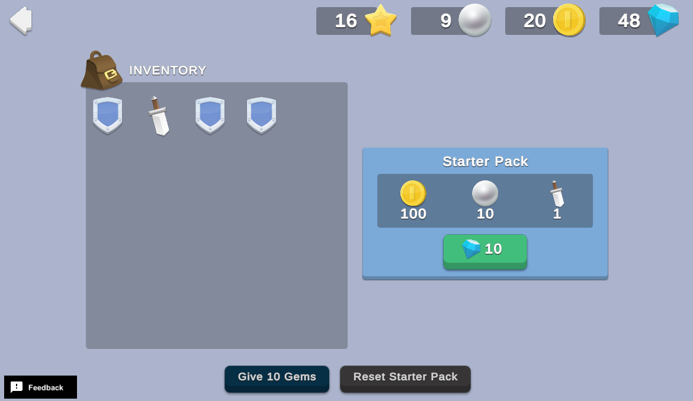

# Starter Pack

Starter packs are one-time deals that grant new players additional resources at a discount. Starter packs improve the onboarding process and boost engagement early, and can also help convert new players to paying users.

This sample demonstrates how to create a one-time starter pack deal in your game that a player can purchase with in-game currency.

## Overview

To see this use case in action:

1. In the Unity Editor **Project** window, select **Assets** > **Use Case Samples** > **Starter Pack**, and then double-click `StarterPackSample.unity` to open the sample scene.
2. Enter Play Mode to interact with the use case.

### Initialization

When the scene loads, the `StarterPackSceneManager.cs` script performs the following initialization tasks:

1. Initializes Unity Gaming Services.
2. Signs in the player [anonymously](https://docs.unity.com/authentication/UsingAnonSignIn.html) using the Authentication service. If you’ve previously initialized any of the other sample scenes, Authentication will use your cached Player ID instead of creating a new one.
3. Retrieves and updates currency balances from the Economy service for that authenticated user.

### Functionality

#### Give 10 Gems

In this example, the starter pack costs 10 Gems. For demonstration purposes, this scene provides a button that grants the player 10 Gems each time it is clicked, which ensures enough currency to test the purchase. When you click the **Give 10 Gems** button, the following occurs:

1. The button's `OnClick` method calls the `StarterPackSceneManager` script's `OnGiveTenGemsButtonPressed` function.
2. `TheOnGiveTenGemsButtonPressed` function calls the Economy service to add 10 Gems to the player's balance, and then the UI code updates the player's resources in the Currency HUD.

**Note**: that the purchase button is temporarily disabled while the currency balance updates.

#### Purchase starter pack

When you click the button to buy the starter pack having 10 or more Gems, the player consumes 10 Gems in exchange for the resources offered in the pack. The following occurs:

1. The button's `OnClick` method calls the `StarterPackSceneManager` script's `OnBuyButtonPressed` function, which sends a request to the Cloud Code service to execute the `PurchaseStarterPack` script.
2. This `PurchaseStarterPack` script queries the Cloud Save service to verify that the player has not yet claimed the deal, and then initiates a purchase directly with the Economy service.
3. If the player has not claimed the deal, the script calls the Economy service to subtract 10 Gems from the player's balance, and then sends an update to the Cloud Save service directly to set a flag that this player has now claimed the deal.
4. The UI code updates the player's resources in the Currency HUD.

The purchase button also updates to indicate that the offer has already been claimed. At this point, you cannot purchase additional starter packs unless you click the **Reset Starter Pack** button, no matter how many Gems you have.

#### Reset Starter Pack

After purchasing a starter pack, the player cannot purchase another one unless they reset their game save. To illustrate this, this scene provides a button to reset the flag so the player can purchase it again. When you click the **Reset Starter Pack** button, the following occurs on the backend:

1. The button's `OnClick` method calls the `StarterPackSceneManager` script's `OnResetPlayerDataButtonPressed` function, which sends a request to the Cloud Code service to execute the `PurchaseStarterPack` script.
2. The script sends an update to the Cloud Save service directly to set a flag that this player has not yet claimed the deal.
3. The UI code reenables the Starter Pack purchase button.

## Setup

### Requirements

To replicate this use case, you need the following [Unity packages](https://docs.unity3d.com/Manual/Packages.html) in your project:

| **Package**                                                                                | **Role**                                                                                               |
| ------------------------------------------------------------------------------------------ | ------------------------------------------------------------------------------------------------------ |
| [Authentication](https://docs.unity.com/authentication/Content/InstallAndConfigureSDK.htm) | Signs in the user anonymously to keep track of their data server-side.                                 |
| [Cloud Code](https://docs.unity.com/Cloud-Code)                                            | Stores important validation logic on the server side.                                                  |
| [Cloud Save](https://docs.unity.com/cloud-save/implementation.html#SDK-installation)       | Stores small pieces of data, such as a flag that indicates if the user has claimed their starter pack. |
| [Economy](https://docs.unity.com/Economy)                                                  | Retrieves the starting and updated currency balances at runtime.                                       |

To use these services in your game, activate each service for your Organization and project in the [Unity Dashboard](https://dashboard.unity3d.com/).

### Dashboard setup

To replicate this sample scene's setup on your own dashboard, you need to:

- Publish one script in Cloud Code.
- Create three Currencies and an Inventory Item for the Economy service.

#### Cloud Code

[Publish the following scripts](https://docs.unity.com/cloud-code/implementation.html#Writing_your_first_script) in the **LiveOps** dashboard:

| **Script**             | **Parameters** | **Description**                                                                                                                                        | **Location in project**                                                   |
|------------------------| -------------- | ------------------------------------------------------------------------------------------------------------------------------------------------------ |---------------------------------------------------------------------------|
| `PurchaseStarterPack`  | None           | Queries the Cloud Save service to verify that the player has not yet claimed the deal, before initiating a purchase directly with the Economy service. | `Assets/Use Case Samples/Starter Pack/Cloud Code/PurchaseStarterPack.js`  |
| `ResetStarterPackFlag` | None           | Resets the starter pack flag to indicate the current player has not yet claimed the deal.                                                              | `Assets/Use Case Samples/Starter Pack/Cloud Code/ResetStarterPackFlag.js` |

**Note**: The Cloud Code scripts included in theCloud Code folder are local copies because you cannot view the sample project's dashboard. Changes to these scripts do not affect the behavior of this sample because they are not automatically uploaded to the Cloud Code service.

#### Economy

[Configure the following resources](https://docs.unity.com/economy/) in the **LiveOps** dashboard:

| **Item** | **ID**  | **Type**       | **Description**                        |
| -------- | ------- |----------------|----------------------------------------|
| Gem      | `GEM`   | Currency       | The cost of the Starter Pack           |
| Coin     | `COIN`  | Currency       | A reward from the Starter Pack         |
| Pearl    | `PEARL` | Currency       | A reward from the Starter Pack         |
| Sword    | `SWORD` | Inventory Item | A reward from the Starter Pack.        |

Also, [configure the following Virtual Purchase resource](https://docs.unity.com/economy/) in the **LiveOps** dashboard:

| **Item**     | **ID**         | **Type**          | **Cost** | **Reward**                      |
|--------------|----------------|-------------------|----------|---------------------------------|
| Starter Pack | `STARTER_PACK` | Virtual Purchase  | 10 Gems  | 100 Coins + 1 Sword + 10 Pearls |
